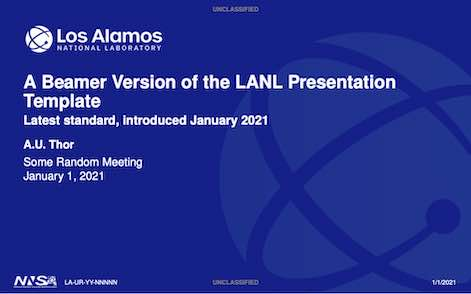

# LANL Beamer Template

This is a Beamer theme designed to approximate the latest version of
the official LANL Powerpoint template, introduced in January 2021.
The repository contains the Beamer `.sty` file, some `.png` files needed
by the theme, and `.tex` source for a small example.

By default, Beamer generates files in 4:3 aspect ratio.  Most users will
want to generate widescreen files using the Beamer `aspectratio=1610`
(or `169`) option.

## Options

* `noclass`  No classification markings in header/footer [default].
* `unclass`  Mark UNCLASSIFIED in header/footer.
* `myclass=<string>`  Mark `string` in header/footer.
* `classcolor=<color>`  Use color `color` for classification markings
  [default = white].
* `slidenum`  Mark slide numbers in footer of each page after the
  title page [default].
* `noslidenum`  Omit slide numbers.

## Special commands

### Title page

In addition to the usual Beamer-provided commands `\title`, `\author`,
`\date`, etc., used to populate the title page, this theme provides
additional LANL-specific commands:
* `\LAUR`  Add a document ID number.  (Usually LA-UR, but could also be
  LA-CP, LA-CC, ...)
* `\leftspecial, \centerspecial, \rightspecial`  Add special text on the
  lower left/center/right of the title slide, such as classification
  markings.

### Section title page

The `\section` command can be used to set a section title.  Then
the commands `\sectionpage` and `\makesection`, similar to the
Beamer-provided commands `\titlepage` and `\maketitle`, will create
section title pages.

## Notes

This template is intended for internal LANL use only.  Please do not
mirror it to external servers such as github.  You are welcome to
mirror it to other internal LANL servers.

This is an unofficial version, and is maintained by the author
in his copious free time.  _Caveat_ _emptor_.  

## Author

Charles Ferenbaugh, _cferenba@lanl.gov_, with some reuse of earlier
work by Jimmy Fung and Bryan Rasmussen.
